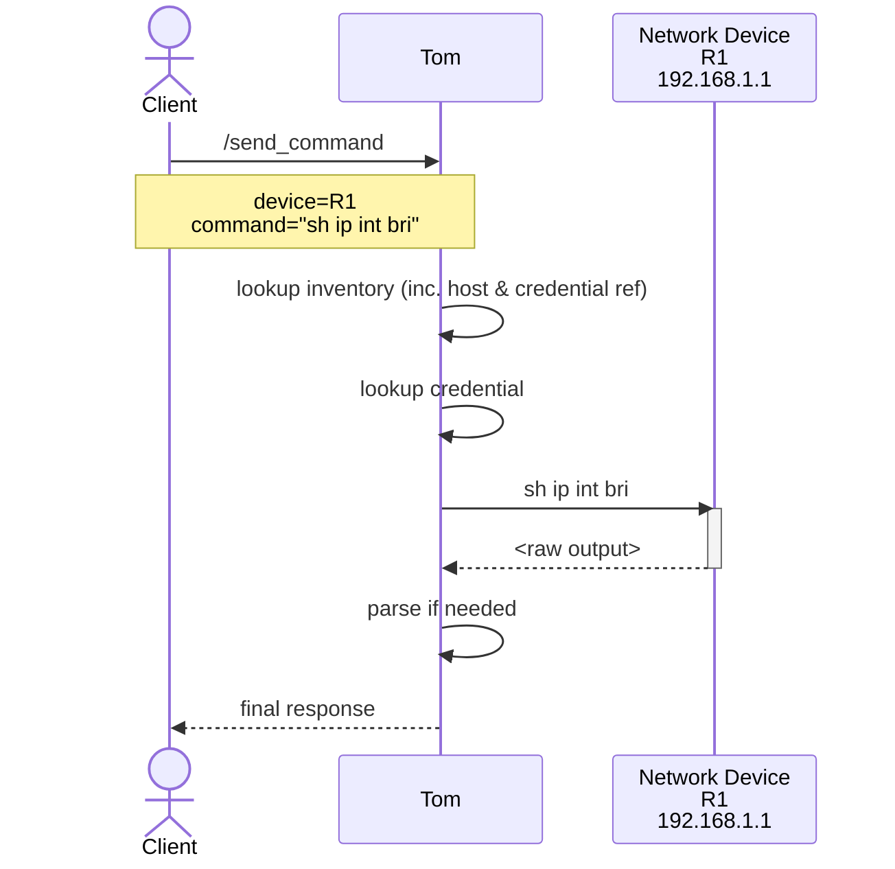

<picture>
  <source media="(prefers-color-scheme: dark)" srcset="services/controller/src/tom_controller/static/Tom-BlkBlueTrans_1000x1000.png">
  
</picture>

# Tom Smykowski

Tom Smykowski is your Network Automation Broker: He takes the network state FROM 
your equipment and gives it TO your developers. He deals with your damn equipment,
so the developers don't have to!

It's like a jump-host for your applications, with all the network automation fiddly
bits taken care of.

## What would you say you do here?
There are lots of things a good network automation project will need, and most of 
them have no reason to be re-invented every time. 

Also, convenience and consistency aside, the service talking directly to users via
a web interface, or chat, etc. has NO business talking directly to your network 
equipment or handling credentials etc. Big teams of great engineers build insecure 
web and chat interfaces ALL THE TIME, and the last thing we want to do is show up 
on some pentest as The Weakest Link.  

Network Automation has a huge toolbox, and integrating with all of it (especially 
doing so well, and securely) is a huge challenge. 

- **Transport/Drivers** - Netmiko, scrapli, etc.
- **Parsing engines and templates** - TextFSM, ttp, genie, etc.
- **Rendering templates** - Jinja2, ttp, etc.
- **Inventory** - Talk to your source-of-truth, digest inventory files, map drivers 
    to different gear from different vendors, make sure you use the correct  
    parsing templates, etc. 
- **Security** - Storing credentials in a way that won't give your security team
    a heart attack, using the right creds for the right gear, JWT/OAuth authentication, etc. 

All of these are solvable, but there's rarely a reason to solve them differently for
each project.  Also, they can be cumbersome and fragile with unpleasant dependence on
system details (looking at you, Templating Libraries!)


## Goals

- **Reusable primitives** - Provide common functionality (templating, parsing, SOT & Inventory integration, queueing, API glue) that can be consumed by multiple automation workflows or tools.
- **Simple deployments** - A single `docker compose` setup for running all services together with dependencies (e.g., Redis).
- **Support runtime changes** - You can update your service config as time goes on
- **Support immutable state** - You can bake your own images so you're guaranteed to have an always redeployable artifact without a bunch of setup or external dependencies.

## Features

### Authentication & Security
- **API Key Authentication** - Simple key-based auth for service accounts
- **JWT/OAuth2 Support** (v0.6.0) - Validate JWTs from OAuth providers:
  - **Duo Security** - Tested with ID tokens and access tokens
  - **Google OAuth** - Tested with ID tokens (access tokens are opaque)
  - **Microsoft Entra ID** - Fully supported
- **Email-Based Authorization** - Control access by user, domain, or regex pattern
- **Hybrid Auth Mode** - Use both API keys and JWTs simultaneously
- **HashiCorp Vault Integration** - Secure credential storage

### Inventory & Automation
- **Multiple Inventory Sources** - YAML files or SolarWinds SWIS
- **Queue-Based Processing** - Async job execution with Redis/SAQ
- **Per-Device Concurrency Control** - Prevent overwhelming devices
- **Multi-Transport Support** - Netmiko and Scrapli adapters

### Parsing & Templating
- **TextFSM Parsing** - 929+ built-in templates via ntc-templates
- **TTP Parsing** - Flexible template-based parsing
- **Custom Template Index** - Register custom templates for auto-discovery
- **Auto-Discovery** - Automatic template selection based on platform and command

## Architecture
### Simplified 


### Detailed
[Detailed Diagram](./docs/overal-sequence-detail.md)

## Documentation

### API & Architecture
- [API Endpoints](./docs/api-endpoints.md) - Complete API reference
- [Roadmap](./ROADMAP.md) - Development roadmap and completed features

### OAuth/JWT Authentication
- [OAuth Implementation](./docs/oauth-implementation.md) - Complete JWT authentication documentation

## Quick Start

### With JWT Authentication
1. Copy the example JWT config:
   ```bash
   cp tom_config.jwt.example.yaml tom_config.yaml
   ```

2. Configure your OAuth providers in `tom_config.yaml`

3. Start the services:
   ```bash
   docker compose up
   ```

4. Use `tomclient` to interact with Tom:
   ```bash
   # Authenticate with your OAuth provider
   tomclient auth login
   
   # Make API calls
   tomclient inventory
   tomclient device router1 "show ip int bri"
   ```

**Note:** The `tomclient` CLI tool is the recommended way to interact with Tom. See the `tomclient` repository for installation and usage.

## Inspiration

- [Netpalm](https://github.com/tbotnz/netpalm/) - Netpalm effectively invented the idea of a Network Automation Broker, and is the direct inspiration for Tom Smykowski.

## Glorious Art
Art by TechnoToast, http://technotoast.art/

## License
Code is MIT - see [LICENSE](./LICENSE)  
Art is licensed for limited usage - see [ART-LICENSE](./ART_LICENSE.txt)
