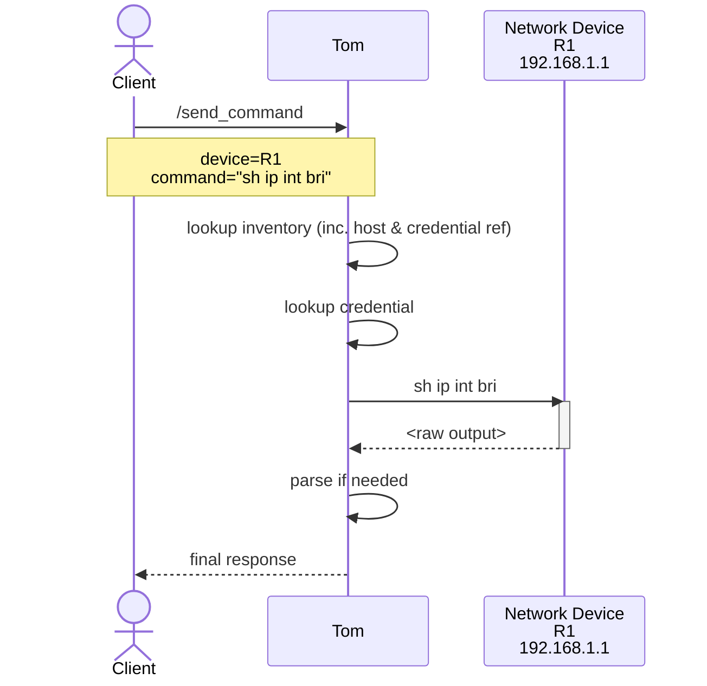

<picture>
  <source media="(prefers-color-scheme: dark)" srcset="services/controller/src/tom_controller/static/Tom-BlkBlueTrans_1000x1000.png">
  
</picture>

# Tom Smykowski

**[Online Documentation](https://wrgeorge1983.github.io/Tom/)** | **[Getting Started Sensibly](https://wrgeorge1983.github.io/Tom/real/getting-started/)** | **[Getting Started Irresponsibly Fast](https://wrgeorge1983.github.io/Tom/real/getting-started-FAST/)** | **[Slack](https://networktocode.slack.com/archives/C0A0PER1Y6L)**

Tom Smykowski is your Network Automation Broker: He takes the network state FROM 
your equipment and gives it TO your developers. He deals with your damn equipment,
so the developers don't have to!

It's like a jump-host for your applications, with all the network automation fiddly
bits taken care of.

## What would you say you do here?
There are lots of things a good network automation project will need, and most of 
them have no reason to be re-invented every time. 

Also, convenience and consistency aside, the service talking directly to users via
a web interface, or chat, etc. has NO business talking directly to your network 
equipment or handling credentials etc. Big teams of great engineers build insecure 
web and chat interfaces ALL THE TIME, and the last thing we want to do is show up 
on some pentest as The Weakest Link.  

Network Automation has a huge toolbox, and integrating with all of it (especially 
doing so well, and securely) is a huge challenge. 

- **Transport/Drivers** - Netmiko, scrapli, etc.
- **Parsing engines and templates** - TextFSM, TTP, etc.
- **Inventory** - Talk to your source-of-truth, digest inventory files, map drivers 
    to different gear from different vendors, make sure you use the correct  
    parsing templates, etc. 
- **Security** - Storing credentials in a way that won't give your security team
    a heart attack, using the right creds for the right gear, JWT/OAuth authentication, etc. 

All of these are solvable, but there's rarely a reason to solve them differently for
each project.  Also, they can be cumbersome and fragile with unpleasant dependence on
system details (looking at you, Templating Libraries!)

## Project Status
**Beta** - Tom is currently feature-somewhat-complete as it were. All the major features are in place and functional, 
but where we expect to support several variations for a given feature, mostly only one is implemented. The project 
is stable and usable in production, but the API will evolve based on feedback and usage.

## Goals

- **Reusable primitives** - Provide common functionality (templating, parsing, SOT & Inventory integration, queueing, API glue) that can be consumed by multiple automation workflows or tools.
- **Simple deployments** - A single `docker compose` setup for running all services together with dependencies (e.g., Redis).
- **Support runtime changes** - You can update your service config as time goes on
- **Support immutable state** - You can bake your own images so you're guaranteed to have an always redeployable artifact without a bunch of setup or external dependencies.

## Features

### Authentication & Security
- **API Key Authentication** - Simple key-based auth for service accounts/automated workflows
- **JWT/OAuth2 Support** (v0.6.0) - Validate JWTs from OAuth providers for interactive use:
  - **Duo Security** - Tested with ID tokens and access tokens
  - **Google OAuth** - Tested with ID tokens (access tokens are opaque)
  - **Microsoft Entra ID** - Fully supported
  - reference implementation for a CLI utility: [tomclient](https://github.com/wrgeorge1983/tomclient)
- **Email-Address-Based Authorization** - Control access by user, domain, or regex pattern
- **HashiCorp Vault Integration** - Secure credential storage

### Inventory & Automation
- **Multiple Inventory Sources** - YAML files, SolarWinds SWIS, Nautobot, NetBox
- **Queue-Based Processing** - Async job execution with Redis/SAQ
- **Per-Device Concurrency Control** - Prevent overwhelming device management planes
- **Multi-Transport Support** - Netmiko and Scrapli adapters

### Parsing & Templating
- **TextFSM Parsing** - 900+ built-in templates via ntc-templates
- **TTP Parsing** - Flexible template-based parsing
- **Auto-Discovery** - Automatic template selection based on platform and command
- **Custom Template Index** - Register custom templates for auto-discovery

### Caching
- **Redis-Backed Cache** - Reduce load on device management planes
- **Worker-Level Caching** - Cache checks before device execution
- **Partial Cache Support** - Mix of cached and fresh data in single request
- **Cache Management API** - Invalidate, clear, and monitor cache
- **Per-Request Control** - Override cache behavior per API call

## Architecture

Tom fits into the [NAF Automation Framework](https://reference.networkautomation.forum/Framework/Framework/#the-architecture) as a "Network Automation Broker" - see the [architecture docs](https://wrgeorge1983.github.io/Tom/latest/real/architecture/) for details.

A simplified diagram of what happens when you make a request:

More detailed architecture diagrams and descriptions are available at [wrgeorge1983.github.io/Tom/latest/real/architecture/](https://wrgeorge1983.github.io/Tom/latest/real/architecture/)

## Documentation

Full documentation is available at **[wrgeorge1983.github.io/Tom](https://wrgeorge1983.github.io/Tom/)** (and also built and deployed with the 'docs'
container in 'docker-compose.yml')

- [Getting Started Fast](https://wrgeorge1983.github.io/Tom/latest/real/getting-started-FAST/) - 5-minute minimal setup
- [Getting Started Sensibly](https://wrgeorge1983.github.io/Tom/latest/real/getting-started/) - More complete setup with Vault
- [Architecture](https://wrgeorge1983.github.io/Tom/latest/real/architecture/) - How Tom's components work together
- [Parsing Guide](https://wrgeorge1983.github.io/Tom/latest/real/parsing/) - TextFSM and TTP parsing

Additional references:
- [Roadmap](./ROADMAP.md) - Development roadmap and completed features
- [Custom Templates](./templates/README.md) - Adding your own parsing templates

## Inspiration

- [Netpalm](https://github.com/tbotnz/netpalm/) - Netpalm effectively invented the idea of a Network Automation Broker, and is the direct inspiration for Tom Smykowski.

## Glorious Art
Art by TechnoToast, http://technotoast.art/

## License
Code is MIT - see [LICENSE](./LICENSE)  
Art is licensed for limited usage - see [ART-LICENSE](./ART_LICENSE.txt)
