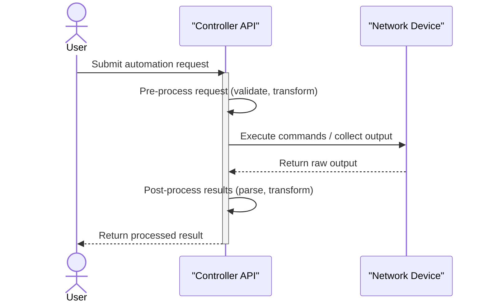

```mermaid
sequenceDiagram
  actor User as User
  participant Controller as "Controller API"
  participant Device as "Network Device"
  User ->> Controller: Submit automation request
  activate Controller
  Controller ->> Controller: Pre-process request (validate, transform)
  Controller ->> Device: Execute commands / collect output
  Device -->> Controller: Return raw output
  Controller ->> Controller: Post-process results (parse, transform)
  Controller -->> User: Return processed result
  deactivate Controller
```