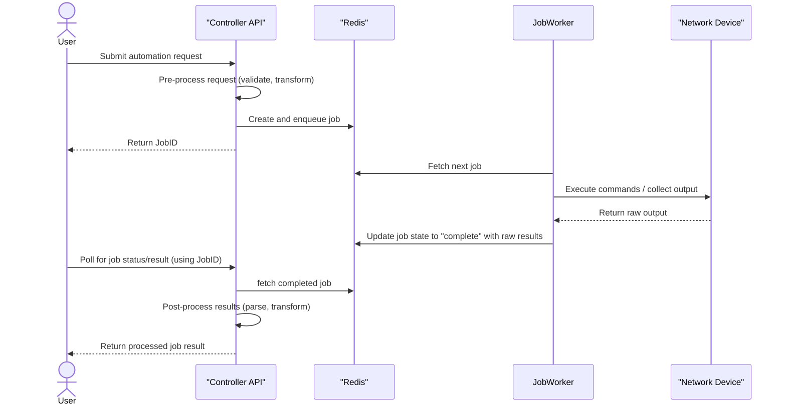

```mermaid
sequenceDiagram
  actor User as User
  participant Controller as "Controller API"
  participant Queue as "Redis"
  participant JobWorker as JobWorker
  participant Device as "Network Device"
  User ->> Controller: Submit automation request
  Controller ->> Controller: Pre-process request (validate, transform)
  Controller ->> Queue: Create and enqueue job
  Controller -->> User: Return JobID
  JobWorker ->> Queue: Fetch next job
  JobWorker ->> Device: Execute commands / collect output
  Device -->> JobWorker: Return raw output
  JobWorker ->> Queue: Update job state to "complete" with raw results
  User ->> Controller: Poll for job status/result (using JobID)
  Controller ->> Queue: fetch completed job
  Controller ->> Controller: Post-process results (parse, transform)
  Controller -->> User: Return processed job result
```
