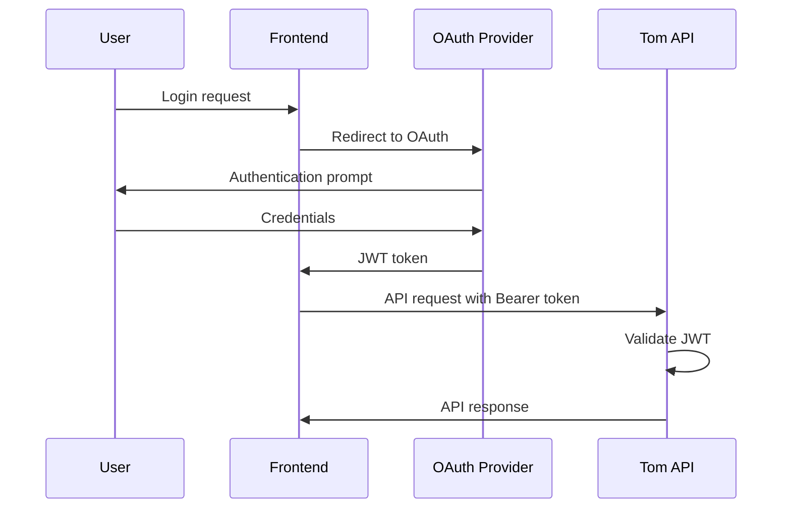

# OAuth/JWT Implementation for Tom Smykowski

## Current Status: IMPLEMENTED (v0.6.0)

### Completed Features:
- JWT validation infrastructure with JWKS and OIDC discovery
- Duo Security validator (tested with PKCE flow, ID tokens, and access tokens)
- Google OAuth validator (tested with PKCE flow and ID tokens)
- Microsoft Entra ID validator (fully supported with OIDC discovery)
- YAML-based configuration with pydantic-settings
- Bearer token authentication in API
- Hybrid authentication mode (JWT + API keys)
- Email-based authorization (users, domains, regex patterns)
- Proper 401 vs 403 error codes
- Test script for JWT token creation and validation
- Example configuration file
- PKCE-based CLI authentication (Python reference implementation)

### Supported OAuth Providers:
- **Duo Security**
- **Google OAuth**
- **Microsoft Entra ID (Azure AD)**

## Overview

Tom Smykowski supports JWT (JSON Web Token) validation for API authentication, enabling integration with various OAuth2/OIDC providers. As an API service, Tom only validates JWTs - it does not handle the OAuth flow itself.

## Architecture

### Authentication Flow



### Core Principles

1. **JWT Validation Only**: Tom validates tokens but doesn't issue them
2. **Multiple Providers**: Support multiple IdPs simultaneously
3. **Email-Based Authorization**: A valid JWT must pass authorization check (allowed_users → allowed_domains → allowed_user_regex). If all are empty, any valid JWT is authorized.
4. **Configuration-Driven**: Provider settings in YAML config files
5. **OIDC Discovery**: Automatic configuration using standard OIDC discovery protocol

## Configuration

### OIDC Discovery Support

Tom automatically discovers OAuth endpoints using the standard OIDC discovery protocol.

**Configuration Example:**
```yaml
jwt_providers:
  - name: google
    enabled: true
    client_id: "your-client-id"
    discovery_url: "https://accounts.google.com/.well-known/openid-configuration"
    # Everything else auto-discovered!
```

### YAML Configuration Structure

```yaml
# tom_config.yaml
auth_mode: jwt  # Options: none, api_key, jwt, hybrid

jwt_settings:
  require_https: true
  leeway_seconds: 30

jwt_providers:
  - name: duo
    enabled: true
    issuer: "https://your-tenant.duosecurity.com"
    client_id: "your-client-id"
    jwks_uri: "https://your-tenant.duosecurity.com/oauth/v1/keys"
    audience: "tom-api"

  - name: google
    enabled: false
    client_id: "your-client.apps.googleusercontent.com"
    discovery_url: "https://accounts.google.com/.well-known/openid-configuration"

  - name: entra
    enabled: false
    tenant_id: "your-tenant-id"
    client_id: "your-client-id"
    discovery_url: "https://login.microsoftonline.com/your-tenant-id/v2.0/.well-known/openid-configuration"
```

### Environment Variables

Simple settings can be configured as environment variables:
- `TOM_AUTH_MODE=jwt`
- `TOM_JWT_REQUIRE_HTTPS=true`
- `TOM_JWT_LEEWAY_SECONDS=30`

## Access Control (Authorization)

Tom implements email-based authorization for JWT-authenticated users:

### Configuration Options

- **allowed_users**: List of exact usernames/emails (case-insensitive match against canonical user identifier)
- **allowed_domains**: List of email domains like "example.com" (extracted from email-like claims)
- **allowed_user_regex**: List of regex patterns tested against canonical user and email (case-insensitive)

### Authorization Logic

- **Precedence**: allowed_users → allowed_domains → allowed_user_regex
- **Any match grants access** (OR logic between rules)
- **If all three lists are empty**, any valid JWT is authorized (backward compatible)
- **Canonical user**: The identifier returned by the provider validator (email | preferred_username | upn | sub)
- **Domain checks**: Extract domain from email-like claims when available
- **Scope**: Applies to JWT/OAuth authentication only. API key auth is unaffected.

### Example Configuration

```yaml
# tom_config.yaml - Global authorization rules for all JWT providers
allowed_users:
  - alice@example.com
  - bob@company.com
  - service.account

allowed_domains:
  - example.com
  - subsidiary.com

allowed_user_regex:
  - '^netops-.*@example\.com$'
  - '^[a-z]+\.admin@example\.com$'
```

### Implementation Files

Authorization is implemented in:
- **Config**: `services/controller/src/tom_controller/config.py`
- **Logic**: `services/controller/src/tom_controller/api/api.py` (jwt_auth function)

## Implementation Details

### File Structure

```
services/controller/src/tom_controller/
├── auth/
│   ├── __init__.py           # Module exports
│   ├── jwt_validator.py      # Base JWT validation logic
│   ├── oidc_discovery.py     # OIDC discovery implementation
│   └── providers.py          # Provider-specific validators
├── config.py                  # JWT settings and provider config
├── exceptions.py              # JWT exceptions
└── api/
    └── api.py                 # Authentication flow with jwt_auth()

Additional files:
├── tom_config.jwt.example.yaml  # Example JWT configuration
└── tests/test_jwt_auth.py       # Test script for JWT validation
```

### Base JWT Validator

The `JWTValidator` class in `auth/jwt_validator.py` provides common JWT validation logic:

- Decodes JWT header to get key ID (kid)
- Fetches public key from JWKS endpoint
- Verifies JWT signature
- Validates standard claims (exp, iat, iss, aud)
- Returns validated claims dictionary

### Provider-Specific Validators

Each provider has a specific validator class in `auth/providers.py`:

#### DuoJWTValidator
- Duo-specific JWT validation
- Works with both ID tokens and access tokens
- User identifier: `preferred_username` or `email` or `sub`

#### GoogleJWTValidator  
- Google-specific JWT validation
- Only ID tokens work (access tokens are opaque)
- Validates email claim presence
- Optionally checks email_verified flag
- User identifier: `email` or `sub`

#### EntraJWTValidator
- Microsoft Entra ID (Azure AD) JWT validation
- Validates tenant ID if configured
- User identifier: `preferred_username` or `upn` or `email` or `sub`

### Authentication Flow

The `jwt_auth()` function in `api/api.py` handles JWT validation:

1. Extract Bearer token from Authorization header
2. Try each enabled provider in sequence
3. Validate token using provider-specific validator
4. Check authorization rules (allowed_users, allowed_domains, allowed_user_regex)
5. Return authentication response with user info and claims

In **hybrid** mode, API key authentication is tried first, then JWT if API key fails.

## Provider Integration Details

### Duo Security

- **OAuth 2.0 + OIDC compliant**
- **JWKS endpoint**: `https://{tenant}.duosecurity.com/oauth/v1/keys`
- **Required claims**: sub, aud, exp, iat
- **User identifier**: email or username in token
- **OIDC discovery**: Supported

### Google OAuth

- **Standard OIDC provider**
- **Well-known endpoint**: `https://accounts.google.com/.well-known/openid-configuration`
- **User identifier**: email claim
- **Note**: Only ID tokens work. Access tokens are opaque and cannot be validated.
- **OIDC discovery**: Supported

### Microsoft Entra ID (Azure AD)

- **Standard OIDC provider**
- **Well-known endpoint**: `https://login.microsoftonline.com/{tenant}/v2.0/.well-known/openid-configuration`
- **Multi-tenant**: Supported with tenant validation
- **User identifier**: email or UPN (User Principal Name)
- **OIDC discovery**: Supported

## Security Considerations

### HTTPS Enforcement

Tom enforces HTTPS for JWT token transmission by default. Keep this enabled in production:

```yaml
jwt_settings:
  require_https: true  # Default: true - keep enabled for production
```

This setting prevents JWT tokens from being transmitted over unencrypted connections. Only disable this for local development/testing.

### External Security Measures

Consider these additional security measures at the infrastructure level:

- **Rate Limiting**: Use a reverse proxy (nginx, traefik) or API gateway to rate-limit, monitor, and control authentication attempts
- **TLS Configuration**: Ensure your reverse proxy/load balancer uses modern TLS versions (1.2+) and strong cipher suites
- **Network Isolation**: Run Tom in a private network, exposing only through authenticated reverse proxies

## Testing
### OAuth Test Endpoint

Tom includes a test HTML page for OAuth flow testing at:
```
http://localhost:8000/static/oauth-test.html
```

This provides a simple interface for testing the OAuth flow with configured providers.
It must be enabled by setting `oauth_test_enabled=true` in `tom_config.yaml` or environment variable.
## PKCE CLI Authentication

Tom includes a reference implementation for PKCE (Proof Key for Code Exchange) authentication in CLI tools. See the example configuration and client library for details on implementing PKCE flow in your applications.

## Future Enhancements

1. **Enhanced RBAC**: Arbitrary claim matching (e.g., Google `hd`, Entra `groups`, custom claims)
2. **Per-Provider Authorization**: Override global rules per provider
3. **Scopes**: OAuth scope-based permissions
4. **Token Refresh**: Handle refresh token flow
5. **Revocation**: Check token revocation lists
6. **Additional Providers**: Support for more OAuth providers as needed
