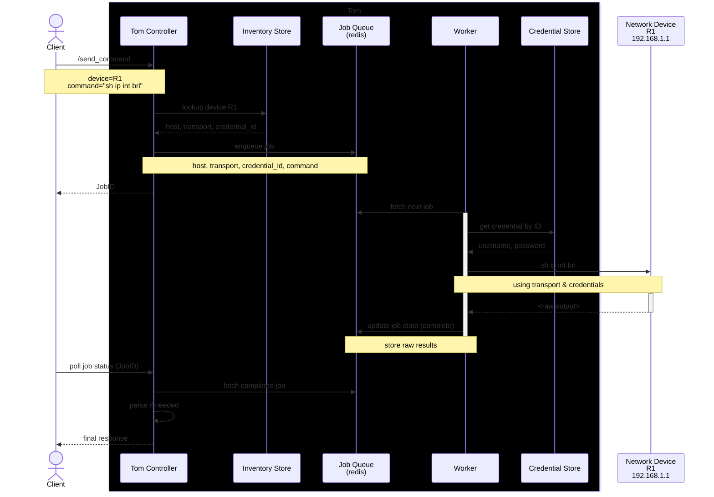

```mermaid
sequenceDiagram
    actor C as Client 
    box Black Tom
    participant T as Tom Controller
    participant IS as Inventory Store
    participant Q as Job Queue <br> (redis)
    participant W as Worker
    participant CS as Credential Store
    end
    participant D as Network Device<br/>R1<br/>192.168.1.1
        
    C ->> T: /send_command
        note over C,T: device=R1<br/>command="sh ip int bri"
    T ->> IS: lookup device R1
    IS -->> T: host, transport, credential_id
    T ->> Q: enqueue job
        note over T,Q: host, transport, credential_id, command
    T -->> C: JobID
    W ->> Q: fetch next job
    activate W
    W ->> CS: get credential by ID
    CS -->> W: username, password
    W ->> D: sh ip int bri
        note over W,D: using transport & credentials
    activate D
        D -->> W: <raw output>
    deactivate D
    W ->> Q: update job state (complete)
        note over W,Q: store raw results
    deactivate W
    C ->> T: poll job status (JobID)
    T ->> Q: fetch completed job
    T ->> T: parse if needed
    T -->> C: final response
```
