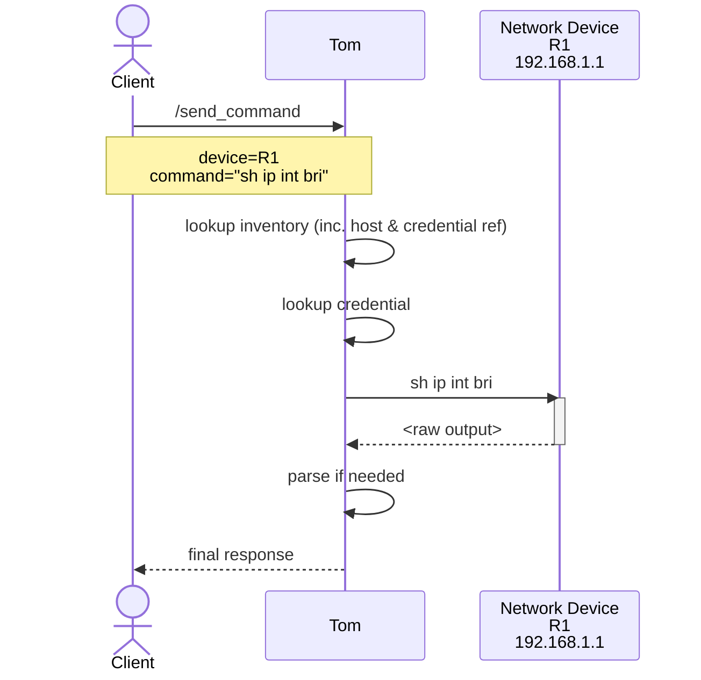

```mermaid
sequenceDiagram
    actor C as Client 
    participant T as Tom
    participant D as Network Device<br/>R1<br/>192.168.1.1
        
    C ->> T: /send_command
        note over C,T: device=R1<br/>command="sh ip int bri"
    T ->> T: lookup inventory (inc. host & credential ref)
    T ->> T: lookup credential
    T ->> D: sh ip int bri
    activate D
        D -->> T: <raw output>
    deactivate D
    T ->> T: parse if needed
    T -->> C: final response 
```
