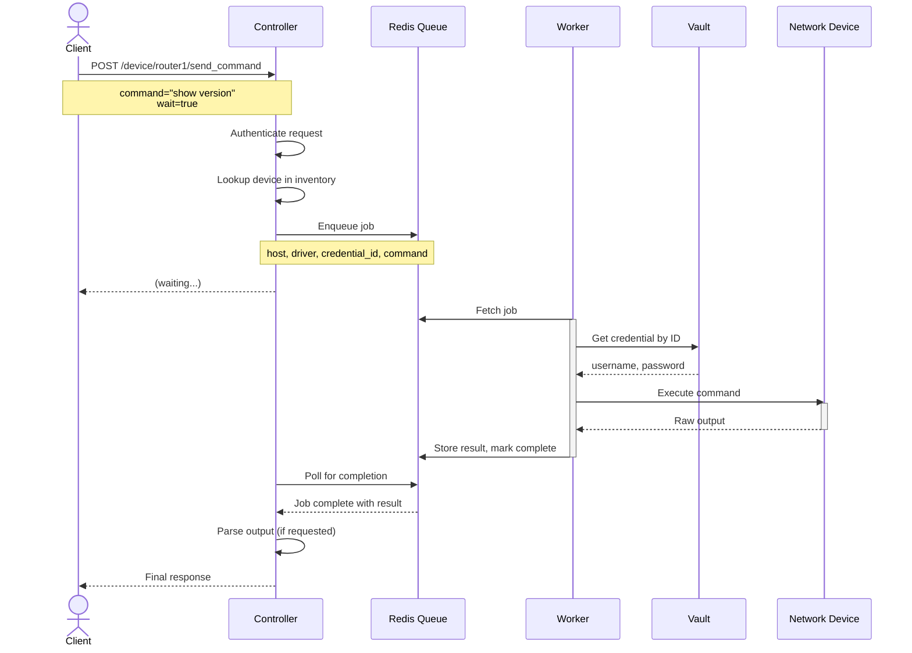
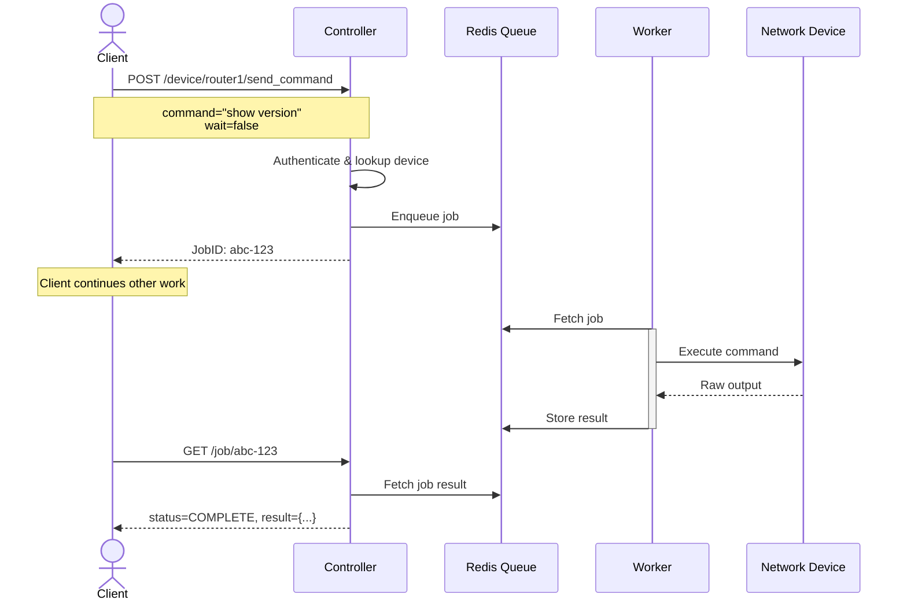
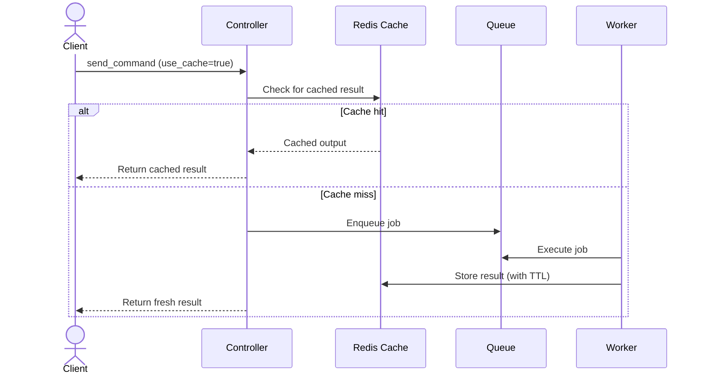

# Architecture

This document explains how Tom's components work together to execute commands on network devices.

## Components

Tom uses a controller-worker architecture:

```
┌─────────────────────────────────────────────────────────────────┐
│                            Tom                                  │
│  ┌─────────────┐    ┌─────────┐    ┌─────────────────────────┐  │
│  │ Controller  │◄──►│  Redis  │◄──►│  Worker (1 or more)     │  │
│  │  (API)      │    │         │    │                         │  │
│  └──────┬──────┘    └────┬────┘    └───────────┬─────────────┘  │
│         │                │                     │                │
│         ▼                │                     ▼                │
│  ┌─────────────┐         │              ┌─────────────┐         │
│  │  Inventory  │         │              │ Credential  │         │
│  │   Source    │         │              │   Store     │         │
│  └─────────────┘         │              └─────────────┘         │
└──────────────────────────┼──────────────────────┼───────────────┘
                           │                      │
                           ▼                      ▼
                    ┌─────────────┐        ┌─────────────┐
                    │   Cache     │        │   Network   │
                    │  (Redis)    │        │   Devices   │
                    └─────────────┘        └─────────────┘
```

### Controller

The controller is a FastAPI application that:

- Exposes the REST API
- Authenticates requests (API key or JWT)
- Looks up devices in the inventory
- Queues jobs to Redis
- Returns results to clients
- Handles parsing (TextFSM/TTP) on completed job output

The controller **never connects to network devices directly**. This separation means a vulnerability in the API layer doesn't provide direct network access.

### Worker

Workers execute the actual network commands:

- Pull jobs from the Redis queue
- Retrieve credentials from Vault (or YAML store)
- Connect to devices using Netmiko or scrapli
- Execute commands and capture output
- Store results back in Redis

You can run multiple workers for higher throughput. Workers enforce per-device concurrency limits to prevent overwhelming devices with simultaneous connections.

### Redis

Redis serves two purposes:

1. **Job Queue**: Using SAQ (Simple Async Queue), jobs flow from controller to workers
2. **Cache**: Command output can be cached to reduce load on device management planes

### Inventory Source

The inventory maps device names to connection parameters:

- Host/IP address
- Adapter type (netmiko or scrapli)
- Platform driver (cisco_ios, arista_eos, etc.)
- Credential reference
- Port

Supported sources:
- YAML file (built-in)
- NetBox (plugin)
- Nautobot (plugin)
- SolarWinds SWIS (plugin)

### Credential Store

Credentials are stored separately from inventory and referenced by ID:

- **HashiCorp Vault** (recommended): Credentials stored encrypted, accessed via token
- **YAML file** (development only): Plain text credentials on disk

## Request Flow

### Synchronous Request (wait=true)

When a client sends a command with `wait=true`, they block until the result is ready:



### Asynchronous Request (wait=false)

When a client sends a command with `wait=false`, they get a job ID immediately and poll for results:



## Job States

Jobs progress through these states:

| State | Meaning |
|-------|---------|
| `NEW` | Job created, not yet queued |
| `QUEUED` | Waiting for a worker |
| `ACTIVE` | Worker is executing the command |
| `COMPLETE` | Success, result available |
| `FAILED` | Error occurred (see error field) |
| `ABORTED` | Job was cancelled |

## Caching

When caching is enabled, the flow shortcuts if a valid cached result exists:



Cache parameters:
- `use_cache=true`: Allow returning cached results
- `cache_ttl=300`: Cache lifetime in seconds
- `cache_refresh=true`: Force fresh execution, update cache

## Credential Flow

Credentials never pass through the controller:

1. Inventory contains `credential_id` (a reference, not the credential itself)
2. Job is queued with `credential_id`
3. Worker fetches actual username/password from Vault using `credential_id`
4. Worker connects to device

This means the API layer never sees device passwords.

**Exception**: Inline credentials (`username`/`password` in request body) bypass Vault. This is useful for testing but not recommended for production.

## Per-Device Concurrency

Workers use semaphores to limit simultaneous connections per device. This prevents overwhelming a device's management plane with too many SSH sessions.

Default: 1 connection per device at a time (configurable).

If multiple jobs target the same device, they queue at the worker level until the device is available.

## Parsing

Parsing happens in the controller after the worker returns raw output:

1. Worker executes command, stores raw output
2. Controller retrieves result
3. If parsing requested, controller applies TextFSM or TTP template
4. Parsed (and optionally raw) output returned to client

Template selection:
- Explicit: `template=cisco_ios_show_version.textfsm`
- Auto-match: Based on platform + command (uses NTC-templates index)

See [Parsing](parsing.md) for details.

## API Reference

Tom includes built-in API documentation via FastAPI's Swagger UI:

- **Swagger UI**: `http://localhost:8000/docs`
- **ReDoc**: `http://localhost:8000/redoc`
- **OpenAPI JSON**: `http://localhost:8000/openapi.json`

For additional examples, see [Simple API Guide](../adhoc/simple_api_guide.md) in the adhoc docs.
