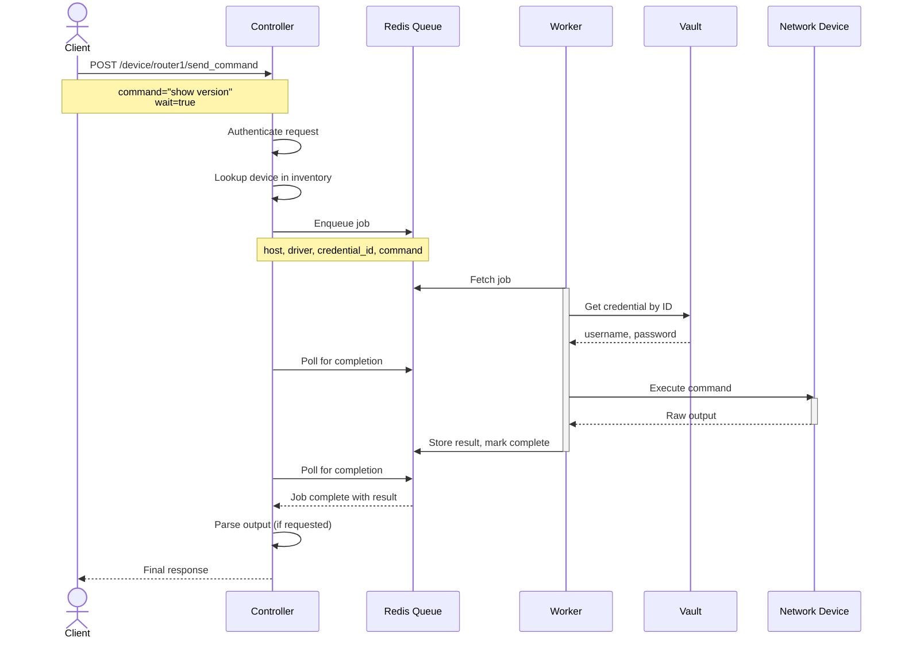
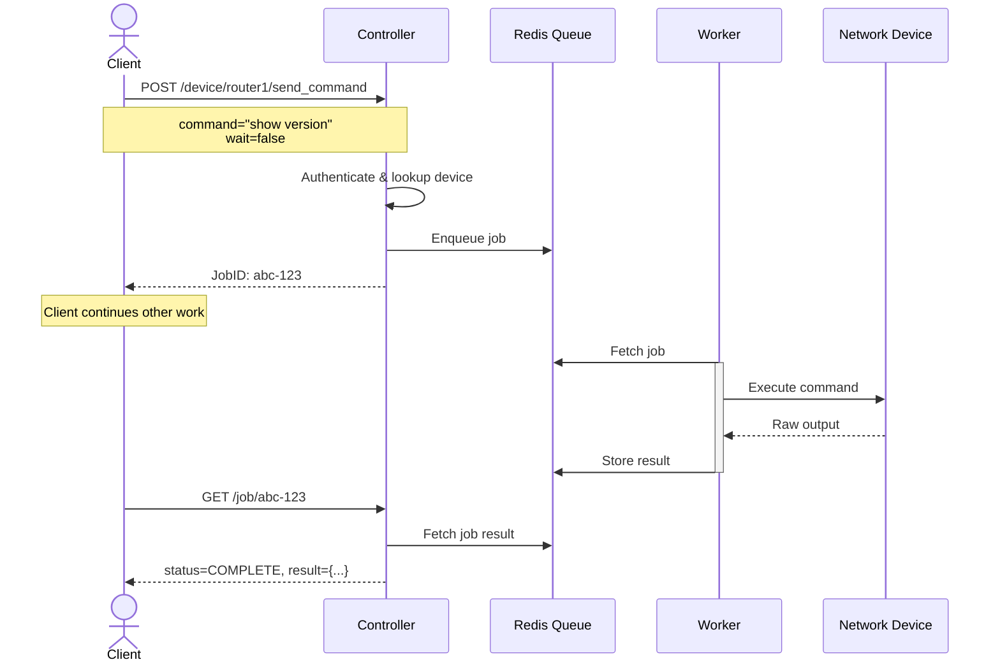
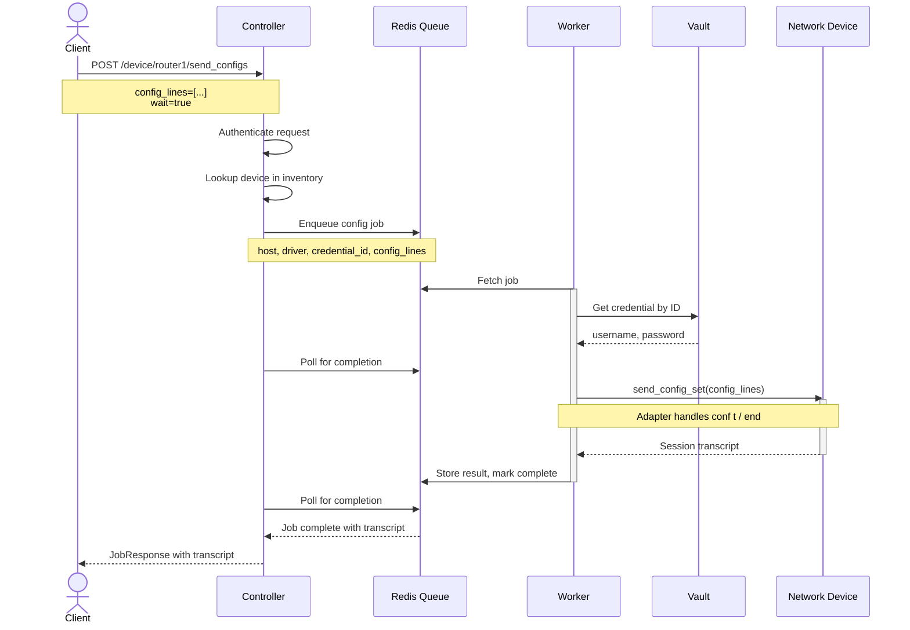
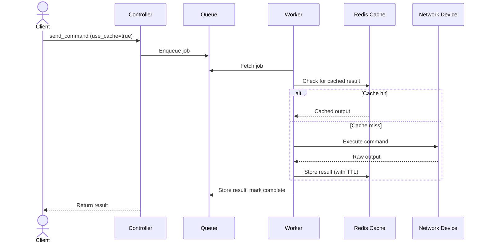

# Architecture

This document explains how Tom's components work together to execute commands on network devices.

## Components

Tom uses a controller-worker architecture:

```
┌─────────────────────────────────────────────────────────────────┐
│                            Tom                                  │
│  ┌─────────────┐    ┌─────────┐    ┌─────────────────────────┐  │  ┌─────────────┐
│  │ Controller  │◄──►│  Redis  │◄──►│  Worker (1 or more)     │◄───►│   Network   │
│  │  (API)      │    │         │    │                         │  │  │   Devices   │
│  └──────┬──────┘    └─────────┘    └───────────┬─────────────┘  │  └─────────────┘
│         │                                      │                │
│         ▼                                      ▼                │
│  ┌─────────────┐                        ┌─────────────┐         │
│  │  Inventory  │                        │ Credential  │         │
│  │   Source    │                        │   Store     │         │
│  └─────────────┘                        └─────────────┘         │
└─────────────────────────────────────────────────────────────────┘
                                                  
```

### Controller

The controller is a FastAPI application that:

- Exposes the REST API
- Authenticates requests (API key or JWT)
- Looks up devices in the inventory
- Queues jobs to Redis
- Returns results to clients
- Handles parsing (TextFSM/TTP) on completed job output

The controller **never connects to network devices directly**. This separation means a vulnerability in the API layer doesn't provide direct network access.

### Worker

Workers execute the actual network operations:

- Pull jobs from the Redis queue
- Retrieve credentials from Vault (or other credential store)
- Connect to devices using Netmiko or Scrapli
- Execute operational commands (show) or push configuration changes
- Store results back in Redis

Workers handle two distinct operation types:

- **Operational commands** (`send_commands`): Uses `send_command()` per command, returns per-command output, supports caching
- **Configuration push** (`send_configs`): Uses `send_config_set()` / `send_configs()`, returns a session transcript, no caching

You can run multiple workers for higher throughput. Workers enforce per-device concurrency limits to prevent overwhelming devices with simultaneous connections.

### Redis

Redis serves two purposes:

1. **Job Queue**: Using SAQ (Simple Async Queue), jobs flow from controller to workers
2. **Cache**: Command output can be cached to reduce load on device management planes

### Inventory Source

The inventory maps device names to connection parameters:

- Host/IP address
- Adapter type (netmiko or scrapli)
- Platform driver (cisco_ios, arista_eos, etc.)
- Credential reference
- Port

Supported sources:
- NetBox
- Nautobot 
- SolarWinds NPM 
- YAML file (if you must) 

### Credential Store

Credentials are stored separately from inventory and referenced by ID:

- **HashiCorp Vault** (recommended): Credentials stored encrypted, accessed via token
- **YAML file** (development only): Plain text credentials on disk

## Request Flow

### Synchronous Request (wait=true)

When a client sends a command with `wait=true`, they block until the result is ready:


```mermaid
sequenceDiagram
    actor C as Client 
    participant T as Controller
    participant Q as Redis Queue
    participant W as Worker
    participant V as Vault
    participant D as Network Device
        
    C ->> T: POST /device/router1/send_command
    note over C,T: command="show version"<br/>wait=true
    T ->> T: Authenticate request
    T ->> T: Lookup device in inventory
    T ->> Q: Enqueue job
    note over T,Q: host, driver, credential_id, command
    
    W ->> Q: Fetch job
    activate W
    W ->> V: Get credential by ID
    V -->> W: username, password
    T ->> Q: Poll for completion
    W ->> D: Execute command
    activate D
    D -->> W: Raw output
    deactivate D
    W ->> Q: Store result, mark complete
    deactivate W
    
    T ->> Q: Poll for completion
    Q -->> T: Job complete with result
    T ->> T: Parse output (if requested)
    T -->> C: Final response
```

**Wait timeout:** If the worker doesn't complete within the `timeout` period, the controller returns a 200 response with the `JobResponse` in its current state (e.g. `ACTIVE` or `QUEUED`). The job is still running -- the client can poll `GET /api/job/{job_id}` for the final result. This is distinct from an enqueue failure, which returns a 500 error.

### Asynchronous Request (wait=false)

When a client sends a command with `wait=false`, they get a job ID immediately and poll for results:


```mermaid
sequenceDiagram
    actor C as Client 
    participant T as Controller
    participant Q as Redis Queue
    participant W as Worker
    participant D as Network Device
        
    C ->> T: POST /device/router1/send_command
    note over C,T: command="show version"<br/>wait=false
    T ->> T: Authenticate & lookup device
    T ->> Q: Enqueue job
    T -->> C: JobID: abc-123
    
    note over C: Client continues other work
    
    W ->> Q: Fetch job
    activate W
    W ->> D: Execute command
    D -->> W: Raw output
    W ->> Q: Store result
    deactivate W
    
    C ->> T: GET /job/abc-123
    T ->> Q: Fetch job result
    T -->> C: status=COMPLETE, result={...}
```

### Configuration Push

Configuration push follows a simpler path than operational commands -- no caching is involved:


```mermaid
sequenceDiagram
    actor C as Client 
    participant T as Controller
    participant Q as Redis Queue
    participant W as Worker
    participant V as Vault
    participant D as Network Device
        
    C ->> T: POST /device/router1/send_configs
    note over C,T: config_lines=[...]<br/>wait=true
    T ->> T: Authenticate request
    T ->> T: Lookup device in inventory
    T ->> Q: Enqueue config job
    note over T,Q: host, driver, credential_id, config_lines
    
    W ->> Q: Fetch job
    activate W
    W ->> V: Get credential by ID
    V -->> W: username, password
    T ->> Q: Poll for completion
    W ->> D: send_config_set(config_lines)
    activate D
    note over W,D: Adapter handles conf t / end
    D -->> W: Session transcript
    deactivate D
    W ->> Q: Store result, mark complete
    deactivate W
    
    T ->> Q: Poll for completion
    Q -->> T: Job complete with transcript
    T -->> C: JobResponse with transcript
```

## Job States

Jobs progress through these states:

| State | Meaning |
|-------|---------|
| `NEW` | Job created, not yet queued |
| `QUEUED` | Waiting for a worker |
| `ACTIVE` | Worker is executing the command |
| `COMPLETE` | Success, result available |
| `FAILED` | Error occurred (see error field) |
| `ABORTED` | Job was cancelled |

## Caching

Caching happens in the **worker**, not the controller. When a job reaches a worker and caching is enabled, the worker checks Redis for cached results before connecting to the device. A job is always queued even if the result is cached -- the savings are in skipping the device connection, not the queue round-trip.

For multi-command jobs, the worker checks each command individually, so a single job can have a mix of cache hits and misses. Only the uncached commands require a device connection.


```mermaid
sequenceDiagram
    actor C as Client
    participant T as Controller
    participant Q as Queue
    participant W as Worker
    participant Cache as Redis Cache
    participant D as Network Device
    
    C ->> T: send_command (use_cache=true)
    T ->> Q: Enqueue job
    W ->> Q: Fetch job
    W ->> Cache: Check for cached result
    alt Cache hit
        Cache -->> W: Cached output
    else Cache miss
        W ->> D: Execute command
        D -->> W: Raw output
        W ->> Cache: Store result (with TTL)
    end
    W ->> Q: Store result, mark complete
    T -->> C: Return result
```

The controller provides cache **management** endpoints (invalidate, clear, list keys, stats) but never reads or writes cached command results itself.

Cache parameters (passed through to worker via job args):
- `use_cache=true`: Allow returning cached results
- `cache_ttl=300`: Cache lifetime in seconds
- `cache_refresh=true`: Force fresh execution, update cache

## Credential Flow

Credentials never pass through the controller:

1. Inventory contains `credential_id` (a reference, not the credential itself)
2. Job is queued with `credential_id`
3. Worker fetches actual username/password from Vault using `credential_id`
4. Worker connects to device

This means the API layer never sees device passwords.

**Exception**: Inline credentials (`username`/`password` in request body) bypass Vault. This is useful for testing but not recommended for production.

## Per-Device Concurrency

Workers use semaphores to limit simultaneous connections per device. This prevents overwhelming a device's management plane with too many SSH sessions.

Default: 1 connection per device at a time (configurable).

If multiple jobs target the same device, they queue at the worker level until the device is available.

## Parsing

Parsing happens in the controller after the worker returns raw output:

1. Worker executes command, stores raw output
2. Controller retrieves result
3. If parsing requested, controller applies TextFSM or TTP template
4. Parsed (and optionally raw) output returned to client

Template selection:
- Explicit: `template=cisco_ios_show_version.textfsm`
- Auto-match: Based on platform + command (uses NTC-templates index)

See [Parsing](parsing.md) for details.

## API Reference

Tom includes built-in API documentation via FastAPI's Swagger UI:

- **Swagger UI**: `http://localhost:8000/docs`
- **ReDoc**: `http://localhost:8000/redoc`
- **OpenAPI JSON**: `http://localhost:8000/openapi.json`

For additional examples, see [Simple API Guide](../adhoc/simple_api_guide.md) in the adhoc docs.
