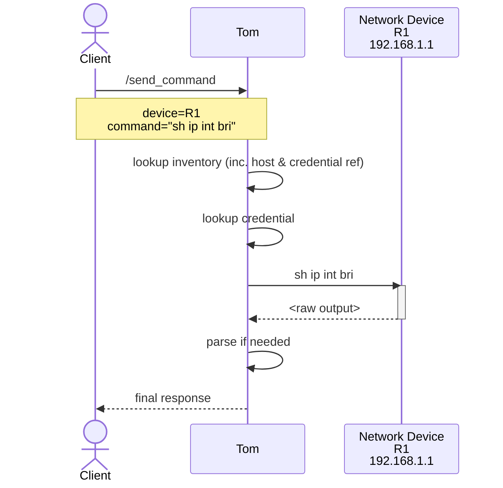

# What is Tom?

## Overview

Tom Smykowski is a Network Automation Broker that takes network state FROM your equipment and gives it TO your developers. He deals with your network equipment, so the developers don't have to.

Think of Tom as a jump-host for your applications, with all the network automation complexities handled for you.

## The Problem

Network automation projects constantly require the same basic components just to make it work00, yet these are often re-implemented for each project. More critically, services that interact directly with users through web interfaces or chat applications should not communicate directly with network equipment or manage credentials. Security vulnerabilities in user-facing services are common, even among experienced engineering teams, and creating a direct path to network infrastructure creates unnecessary risk.

The network automation ecosystem offers a substantial toolbox—transport drivers, parsing engines, template renderers, inventory systems, and credential management—but integrating these components well and securely represents a significant engineering challenge that shouldn't be repeated for every project.

## What Tom Provides

Tom serves as a centralized broker that handles:

- **Transport and Drivers**: Integration with Netmiko, Scrapli, and other ways of directly interacting with your equipment
- **Parsing**: Support for TextFSM, TTP, and other parsing engines with 900+ built-in templates (courtesy of the [NTC Templates repo](https://github.com/networktocode/ntc-templates))
- **Inventory Management**: Plugin-based system supporting Nautobot, NetBox, and SolarWinds NPM (and also YAML files if your really must)
- **Security**: HashiCorp Vault integration for credentials, JWT/OAuth2 authentication for users
- **Queue Management**: Asynchronous job processing with per-device concurrency control
- **Caching**: Optional response caching to reduce load on device management planes and faster responses

## Architecture

Tom fits into the [NAF Automation Framework](https://reference.networkautomation.forum/Framework/Framework/#the-architecture) like so: 

The process of using Tom looks like this: 

Internally, Tom uses a controller-worker architecture that is discussed in more detail in [Architecture](architecture.md),
but the most important detail to understand is that **Tom is NOT another library or code-level dependency. Instead, it's a standalone
service typically deployed as a set of Docker containers**.

In fact, that's a big part of the point: your automation code will be better, smaller, faster, more stable, and more secure 
if you don't have to pull in all the dependencies required to handle all that network equipment directly.

### Components

**Controller**: FastAPI-based REST API that handles authentication, inventory lookups, and job queueing. The controller never directly connects to network devices.

**Worker**: Executes network commands using Netmiko or scrapli adapters. Workers retrieve credentials from Vault, manage per-device concurrency, and handle response parsing.

**Redis**: Provides job queueing via SAQ (Simple Async Queue) and response caching.

## Project Status

**Beta** - Tom is feature-complete for core functionality. All major features are implemented and the project is stable for production use, though the API may evolve based on real-world feedback. Where multiple variations of a feature are planned, typically one implementation currently exists.

## Design Philosophy

- **Reusable primitives**: Common functionality (templating, parsing, inventory integration, queueing) consumable by multiple automation workflows
- **Simple deployments**: Single docker-compose setup for all services and dependencies
- **Runtime flexibility**: Service configuration can be updated without rebuilding images
- **Immutable deployment option**: Ability to bake custom images for guaranteed redeployable artifacts

## Next Steps

- [Getting Started Fast](getting-started-FAST.md) - 5-minute minimal setup
- [Getting Started Sensibly](getting-started.md) - More complete setup with Vault
- [Architecture](architecture.md) - How Tom's components work together
- [Nautobot Device Setup](nautobot-device-setup.md) - Configure devices in Nautobot for Tom
- [Parsing](parsing.md) - Using TextFSM and TTP parsers
- [API Documentation](http://localhost:8000/docs) - Swagger UI (when Tom is running)
