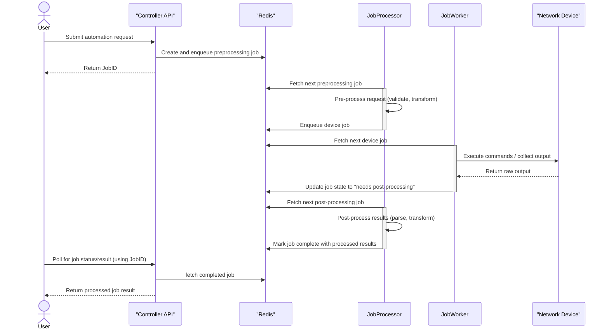

```mermaid
sequenceDiagram
  actor User as User
  participant Controller as "Controller API"
  participant Queue as "Redis"
  participant JobProcessor as JobProcessor
  participant JobWorker as JobWorker
  participant Device as "Network Device"
  User ->> Controller: Submit automation request
  Controller ->> Queue: Create and enqueue preprocessing job
  Controller -->> User: Return JobID
  JobProcessor ->> Queue: Fetch next preprocessing job
  activate JobProcessor
  JobProcessor ->> JobProcessor: Pre-process request (validate, transform)
  JobProcessor ->> Queue: Enqueue device job
  deactivate JobProcessor
  JobWorker ->> Queue: Fetch next device job
  activate JobWorker
  JobWorker ->> Device: Execute commands / collect output
  Device -->> JobWorker: Return raw output
  JobWorker ->> Queue: Update job state to "needs post-processing"
  deactivate JobWorker
  JobProcessor ->> Queue: Fetch next post-processing job
  activate JobProcessor
  JobProcessor ->> JobProcessor: Post-process results (parse, transform)
  JobProcessor ->> Queue: Mark job complete with processed results
  deactivate JobProcessor
  User ->> Controller: Poll for job status/result (using JobID)
  Controller ->> Queue: fetch completed job
  Controller -->> User: Return processed job result
```
