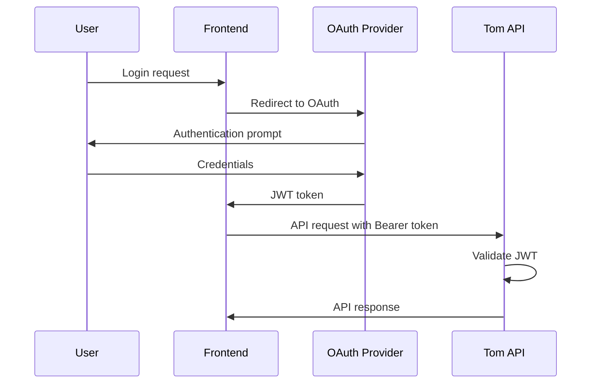

# OAuth/JWT Implementation for Tom Smykowski

## Current Status: ✅ IMPLEMENTED (v0.6.0) - Duo Tested, Others Speculative

### What's Been Completed:
- ✅ JWT validation infrastructure
- ✅ **Duo Security validator - TESTED AND WORKING**
- ⚠️ Provider-specific validators (Google, GitHub, Microsoft Entra ID) - **SPECULATIVE/UNTESTED**
- ✅ YAML-based configuration with pydantic-settings
- ✅ Bearer token authentication in API
- ✅ Hybrid authentication mode (JWT + API keys)
- ✅ JWT exceptions integrated into main exception hierarchy
- ✅ Test script for JWT token creation and validation
- ✅ Example configuration file
- ✅ PKCE-based CLI authentication (Python reference implementation)

### Provider Status:
- ✅ **Duo Security**: Fully tested with PKCE flow, ID tokens, and access tokens
- ✅ **Google OAuth**: Fully tested with PKCE flow and ID tokens (access tokens are opaque, not JWTs)
- ⚠️ **Microsoft Entra ID**: Speculative implementation based on OIDC standards (UNTESTED)

### What's Remaining:
- ⏳ Test and validate Google, GitHub, Microsoft Entra providers
- ⏳ Frontend OAuth flow handler for testing
- ⏳ RBAC from JWT claims
- ⏳ Token refresh flow
- ⏳ Metrics and monitoring
- ⏳ Go client library with PKCE support

## Overview

Tom Smykowski will support JWT (JSON Web Token) validation for API authentication, enabling integration with various OAuth2/OIDC providers. As an API service, Tom only validates JWTs - it does not handle the OAuth flow itself.

## Architecture

### Authentication Flow



### Core Principles

1. **JWT Validation Only**: Tom validates tokens but doesn't issue them
2. **Multiple Providers**: Support multiple IdPs simultaneously
3. **Authenticated = Authorized**: Initial implementation treats any valid JWT as full access
4. **Configuration-Driven**: Provider settings in YAML config files
5. **Explicit Code Paths**: Balance between DRY and obvious behavior

## Configuration

### OIDC Discovery Support

Tom supports **OIDC Discovery** for automatic provider configuration. See [docs/oidc-discovery.md](./oidc-discovery.md) for details.

**Current Status:**
- ✅ Config schema supports `discovery_url`
- ⚠️ Discovery helper module implemented but not integrated into validators yet
- ⚠️ Validators use hardcoded defaults for now

**Recommended Configuration (when discovery is fully integrated):**
```yaml
jwt_providers:
  - name: google
    enabled: true
    client_id: "your-client-id"
    discovery_url: "https://accounts.google.com/.well-known/openid-configuration"
    # Everything else auto-discovered!
```

### YAML Configuration Structure

```yaml
# tom_config.yaml
auth_mode: jwt  # Options: none, api_key, jwt, hybrid

jwt_settings:
  require_https: true
  leeway_seconds: 30

jwt_providers:
  - name: duo
    enabled: true
    issuer: "https://your-tenant.duosecurity.com"
    client_id: "your-client-id"
    jwks_uri: "https://your-tenant.duosecurity.com/oauth/v1/keys"
    audience: "tom-api"

  - name: google
    enabled: false
    issuer: "https://accounts.google.com"
    client_id: "your-client.apps.googleusercontent.com"
    # Google's JWKS URI is derived from well-known endpoint

  - name: github
    enabled: false
    app_id: "123456"
    # GitHub App private key for verification
    private_key_path: "/path/to/github-app.pem"

  - name: entra
    enabled: false
    tenant_id: "your-tenant-id"
    client_id: "your-client-id"
    issuer: "https://login.microsoftonline.com/your-tenant-id/v2.0"
```

### Environment Variables

Simple settings remain as environment variables:
- `TOM_AUTH_MODE=jwt`
- `TOM_JWT_REQUIRE_HTTPS=true`
- `TOM_JWT_LEEWAY_SECONDS=30`

## Implementation Details

### File Structure (As Implemented)

```
services/controller/src/tom_controller/
├── auth/
│   ├── __init__.py           # Module exports
│   ├── jwt_validator.py      # Base JWT validation logic
│   └── providers.py          # Provider-specific validators
├── config.py                  # Updated with JWT settings
├── exceptions.py              # Contains all exceptions including JWT
└── api/
    └── api.py                 # Updated auth flow with jwt_auth()

Additional files:
├── tom_config.jwt.example.yaml  # Example JWT configuration
└── test_jwt_auth.py             # Test script for JWT validation
```

### Base JWT Validator

```python
# auth/jwt_validator.py
class JWTValidator:
    """Base class for JWT validation with common logic"""

    def __init__(self, config: JWTProviderConfig):
        self.config = config
        self._jwks_client = None

    async def validate_token(self, token: str) -> dict:
        """Validate JWT and return claims"""
        # Decode header to get kid
        # Fetch public key from JWKS
        # Verify signature
        # Validate standard claims (exp, iat, iss, aud)
        # Return claims dict
        pass

    async def get_signing_key(self, token: str):
        """Get the public key for token verification"""
        pass
```

### Provider-Specific Validators

```python
# auth/providers.py
class DuoJWTValidator(JWTValidator):
    """Duo-specific JWT validation"""

    async def validate_token(self, token: str) -> dict:
        # Duo-specific validation if needed
        claims = await super().validate_token(token)
        # Additional Duo-specific checks
        return claims

class GoogleJWTValidator(JWTValidator):
    """Google-specific JWT validation"""
    # Inherits most behavior, overrides only where needed

class GitHubJWTValidator(JWTValidator):
    """GitHub App JWT validation"""

    def __init__(self, config: JWTProviderConfig):
        super().__init__(config)
        # Load GitHub App private key
        self.private_key = self._load_private_key()

    async def validate_token(self, token: str) -> dict:
        # GitHub uses app-specific signing
        pass

class EntraJWTValidator(JWTValidator):
    """Microsoft Entra ID (Azure AD) JWT validation"""
    # Standard OIDC flow, minimal overrides needed
```

### Updated Authentication Flow

```python
# api/api.py
async def do_auth(request: Request) -> AuthResponse:
    settings = request.app.state.settings

    if settings.auth_mode == "none":
        return {"method": "none", "user": None}

    # Check for API key first (in hybrid mode)
    if settings.auth_mode in ["api_key", "hybrid"]:
        try:
            return api_key_auth(request)
        except TomAuthException:
            if settings.auth_mode == "api_key":
                raise
            # Continue to JWT check in hybrid mode

    # Check for JWT
    if settings.auth_mode in ["jwt", "hybrid"]:
        return await jwt_auth(request)

    raise TomException(f"Unknown auth mode {settings.auth_mode}")

async def jwt_auth(request: Request) -> AuthResponse:
    """Validate JWT from Authorization header"""
    auth_header = request.headers.get("Authorization")
    if not auth_header or not auth_header.startswith("Bearer "):
        raise TomAuthException("Missing or invalid Bearer token")

    token = auth_header[7:]  # Remove "Bearer " prefix

    # Try each enabled provider
    for provider_config in request.app.state.settings.jwt_providers:
        if not provider_config.enabled:
            continue

        validator = get_jwt_validator(provider_config)
        try:
            claims = await validator.validate_token(token)
            return {
                "method": "jwt",
                "user": claims.get("email") or claims.get("sub"),
                "provider": provider_config.name,
                "claims": claims
            }
        except JWTValidationError:
            continue  # Try next provider

    raise TomAuthException("Invalid JWT token")
```

## Provider Integration Details

### Duo Security

- **OAuth 2.0 + OIDC compliant**
- **JWKS endpoint**: `https://{tenant}.duosecurity.com/oauth/v1/keys`
- **Required claims**: sub, aud, exp, iat
- **User identifier**: email or username in token

### Google

- **Standard OIDC provider**
- **JWKS endpoint**: Derived from well-known configuration
- **Well-known**: `https://accounts.google.com/.well-known/openid-configuration`
- **User identifier**: email claim

### GitHub

- **GitHub Apps authentication**
- **Uses app-specific private key for verification**
- **No JWKS endpoint - uses configured private key**
- **User identifier**: GitHub username

### Microsoft Entra ID (Azure AD)

- **Standard OIDC provider**
- **JWKS endpoint**: `https://login.microsoftonline.com/{tenant}/discovery/v2.0/keys`
- **Multi-tenant support possible**
- **User identifier**: email or UPN

## Testing Strategy

### Unit Tests
- Mock JWT tokens for each provider
- Test signature validation
- Test claim validation
- Test expiration handling

### Integration Tests
- Test with real provider test accounts
- Validate full authentication flow
- Test token refresh scenarios

### Test Frontend
- Minimal web UI for OAuth flow demonstration
- Support all configured providers
- Display JWT claims after successful auth

## Security Considerations

1. **HTTPS Only**: Enforce HTTPS in production for JWT transmission
2. **Token Expiration**: Strict validation of exp claim
3. **Clock Skew**: Allow configurable leeway for time-based claims
4. **Audience Validation**: Ensure tokens are intended for Tom API
5. **Signature Verification**: Always verify JWT signatures
6. **JWKS Caching**: Cache public keys with appropriate TTL
7. **Rate Limiting**: Consider rate limits on auth attempts

## Future Enhancements

1. **RBAC**: Role-based access control from JWT claims
2. **Scopes**: OAuth scope-based permissions
3. **Token Refresh**: Handle refresh token flow
4. **Revocation**: Check token revocation lists
5. **Custom Claims**: Support custom claim validation
6. **Metrics**: Auth success/failure metrics

## Dependencies (Installed)

Added via `uv add`:
- `python-jose`: JWT encoding/decoding
- `cryptography`: For key handling and RSA operations
- `httpx`: Async HTTP client for JWKS fetching (was already present)

## How to Use

1. **Configure JWT providers** in `tom_config.yaml`:
   - Copy `tom_config.jwt.example.yaml` as starting point
   - Set `auth_mode: jwt` or `auth_mode: hybrid`
   - Configure your providers with client IDs, issuers, etc.

2. **Start the controller** with JWT config:
   ```bash
   export TOM_CONFIG_FILE=tom_config.yaml
   uv run uvicorn tom_controller.main:app
   ```

3. **Make authenticated API calls**:
   ```bash
   # With JWT token
   curl -H "Authorization: Bearer YOUR_JWT_TOKEN" http://localhost:8020/api/

   # With API key (in hybrid mode)
   curl -H "X-API-Key: your-api-key" http://localhost:8020/api/
   ```

4. **Test with the test script**:
   ```bash
   cd services/controller
   uv run python test_jwt_auth.py
   ```

## Go Client Implementation

See these files for Go implementation guidance:
- **`GO_OAUTH_MINIMAL_EXAMPLE.md`** - Complete minimal implementation (~250 lines)
- **`GO_CLIENT_OAUTH_GUIDE.md`** - Detailed integration guide with Duo specifics
- **`OAUTH_STATUS.md`** - Current implementation status and next steps

Python reference implementations:
- `cli_auth_pkce.py` - PKCE flow (200 lines)
- `tom_cli_auth.py` - Config and token management (318 lines)
- `CLI_AUTH_GUIDE.md` - Python usage guide

## References

- [Duo OAuth Documentation](https://duo.com/docs/oauth)
- [Google Identity Platform](https://developers.google.com/identity)
- [GitHub Apps Authentication](https://docs.github.com/en/apps/creating-github-apps/authenticating-with-a-github-app)
- [Microsoft Identity Platform](https://docs.microsoft.com/en/azure/active-identity/develop/)
- [JWT.io](https://jwt.io/)
- [OpenID Connect Spec](https://openid.net/connect/)